# 今日学习任务


- [ ] 01-transition过渡动画
- [ ] 02-transform属性2D转换
  - [ ] ==2D平移==
  - [ ] ==2D旋转==
    - [ ] 修改元素旋转基准点
  - [ ] ==2D缩放==
  - [ ] 2D倾斜
  - [ ] 案例：大风车
- [ ] 03-transform属性3D转换
  - [ ] 3D平移
  - [ ] 3D旋转
  - [ ] 3D缩放
  - [ ] 案例：制作立方体
- [ ] 04-animation帧动画


# 一、过渡动画

## 1. 什么是过渡动画

示例：使用hover实现位置变换

```html
<!DOCTYPE html>
<html lang="en">
<head>
    <meta charset="UTF-8">
    <meta name="viewport" content="width=device-width, initial-scale=1.0">
    <title>Document</title>
    <style>
        *{
            margin:0;
            padding:0;
        }
        .box{
            width:200px;
            height:200px;
            background:cyan;
            position: absolute;
            left:0;
            top:0;
        }
        .box:hover{
            left:100px;
            top:100px;
        }
    </style>
</head>
<body>
    <div class="box"></div>
</body>
</html>
```

以上示例中盒子从0px位置瞬间移动到了100px位置，根本没有看到中间的位置变化的过程。如果想看到中间位置变化的过程就是==过渡动画==。

## 2. transition是复合属性

transition属性是一个复合属性，复合属性有多个派生子属性，类似于background属性、border属性...

background	复合属性。以下是background的派生子属性(都是以background开头)：

>  background-image	
>
> background-color
>
> background-repeat
>
> background-position


border	复合属性。以下是border的派生子属性(都是以border开头)：

> border-style
>
> border-width
>
> border-color


## 3. transition属性介绍

+ transition-property

> 需要应用过渡效果的属性名
>
> 例如：width、top、color、background-color、==all(表示所有属性，使用的最多)==

+ transition-duration

> 过渡效果持久的时间，单位：s(秒用的最多)、ms(毫秒)
>
> 例如：1s表示1秒		500ms表示500毫秒
>
> :point_right: 此属性必须设置，因为默认是0, 0表示动画的持续时间没有，所以看不到效果。

+ transition-timing-function

> 过渡效果速度类型
>
> 常用ease，表示过渡效果的速度由慢变快，再由快降到慢。

+ transition-delay

> 过渡动画开始之前等待的时间(延时时间)

示例：

> ```html
> <!DOCTYPE html>
> <html lang="en">
> <head>
>     <meta charset="UTF-8">
>     <meta name="viewport" content="width=device-width, initial-scale=1.0">
>     <title>Document</title>
>     <style>
>         *{
>             margin:0;
>             padding:0;
>         }
>         .box{
>             width:200px;
>             height:200px;
>             left:0;
>             top:0;
>             background:cyan;
>             position: absolute;
>             /* 
>             transition-property：应用过渡效果的属性
>             transition-duration：过渡效果持续的时间
>             transition-timing-function: 过渡效果的时间曲线
>             transition-delay: 动画的延时时间(一般不使用)
>             */
> 
>             /* 
>             transition-property: all;
>             transition-duration: 1s;
>             transition-timing-function: linear; 
>             transition-delay: 3s; 
>             */
> 
>             /* 使用复合属性 */
>             transition: all 1s linear 3s;
>         }
>         .box:hover{
>             left:100px;
>             top:100px;
>             background: blue;
>         }
>     </style>
> </head>
> <body>
>     <div class="box"></div>
> </body>
> </html>
> ```
>
> 


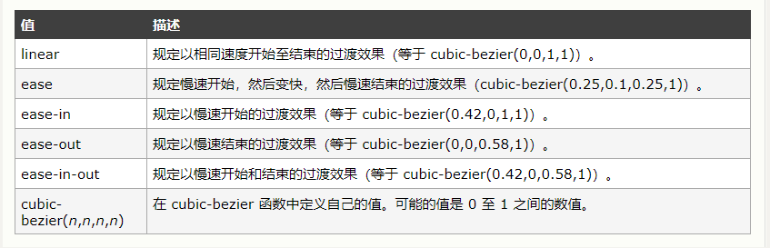

---

+ 细节：

> 1. 过渡动画绝大多数是设置在初始状态内，而不是终止状态内设置。
>
> 2. 如果多个属性的动画效果不一致，在复合属性中要使用逗号分隔分开书写(这种情况很少)。
>
> > 例如：left属性过渡效果要持续2秒，top属性要持续3秒，background-color持续4秒
> >
> > ```html
> > transition: left 2s linear,top 3s linear,background-color 4s;
> > ```
>
> 


# 二、transform2d变换

## 1. transform属性介绍

​	transform属性主要用于实现==平移==、==旋转==、==缩放==、==倾斜==效果，所以==平移==、==旋转==、==缩放==、==倾斜==都是transform的属性值。

常用的属性值如下：

> + transform:==translate()==
>
> > 变换效果
>
> + transform:==rotate()==
>
> > 旋转效果
>
> + transform:==scale()==
>
> > 缩放效果
>
> + transform:==skew()==
>
> > 倾斜效果(不常用)

全部属性值

> 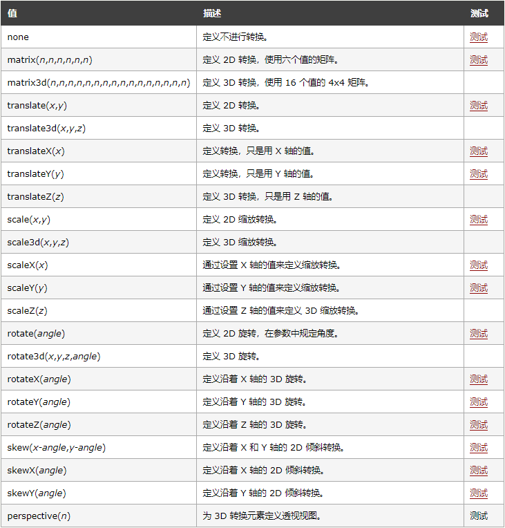
>
> ` 以上变换，可以分为两类，2d变换、3d变换`

## 2. translate 2d平移

css语法:

> transform:translate(x,y)

说明：

> 以元素当前的位置为相对参照，进行水平、垂直方向移动。
>
> x 表示水平方向移动，正数向右，负数向左
>
> y 表示垂直方向移动，正数向下，负数向上
>
> x、y的取值如果是百分比，则是相对于元素本身尺寸。
>
> `如果设置1个值，表示只进行水平平移。`

示例：

> ```html
> <!DOCTYPE html>
> <html lang="en">
> <head>
>     <meta charset="UTF-8">
>     <meta name="viewport" content="width=device-width, initial-scale=1.0">
>     <title>Document</title>
>     <style>
>         *{
>             margin:100px;
>         }
>         .box{
>             width:100px;
>             height:50px;
>             background:cyan;
>         }
>         .box:hover{
>             /* transform: translate(10px,20px); */
>             /* 负值为反方向移动 */
>             transform: translate(-10px,-20px);
>         }
>     </style>
> </head>
> <body>
>     <div class="box"></div>
> </body>
> </html>
> ```
>
> 

课堂练习：利用translate完美的实现元素的垂直居中，且自适应父元素宽度。

> 思路：
>
> > 1. 利用定位，设置left:10%; top:50%;
> >
> > > 定位的left、top是相对于父元素尺寸的，
> > >
> > > 会移多出一部分，而这部分正好是元素尺寸的一半
> >
> > 2. 通过平移，让元素向左向上拉回自身的一半
>
> ```html
> <!DOCTYPE html>
> <html lang="en">
> <head>
>     <meta charset="UTF-8">
>     <meta name="viewport" content="width=device-width, initial-scale=1.0">
>     <title>Document</title>
>     <style>
>         *{
>             margin:0;
>         }
>         .box{
>             width:300px;
>             height:200px;
>             background:cyan;
>             /* 利用定位，设置left:10%; top:50%; */
>             position: absolute;
>             left: 50%;
>             top: 50%;
>             /* 利用平移 */
>             transform:translate(-50%,-50%);
>         }
>         
>     </style>
> </head>
> <body>
>     <div class="box"></div>
> </body>
> </html>
> ```

案例：上浮阴影

> ```html
> <!DOCTYPE html>
> <html lang="en">
> <head>
>     <meta charset="UTF-8">
>     <meta name="viewport" content="width=device-width, initial-scale=1.0">
>     <title>Document</title>
>     <style>
>         .wrap{
>             background: #f5f5f5;
>             width: 1040px;
>             margin: 0 auto;
>             display: flex;
>             flex-wrap: wrap;
>             justify-content: space-around;
>         }
>         .wrap div{
>             margin: 10px 0;
>             width: 240px;
>             height: 300px;
>             background: #fff;
>             transition:all 0.2s linear;
>         }
> 
>         .wrap div:hover{
>             transform:translate(0, -3px);
>             box-shadow: 0 15px 30px rgba(0,0,0,.1);
>         }
>         
>     </style>
> </head>
> <body>
>     <div class="wrap">
>         <div></div>
>         <div></div>
>         <div></div>
>         <div></div>
>         <div></div>
>         <div></div>
>         <div></div>
>         <div></div>
>     </div>
> </body>
> </html>
> ```

案例：侧栏移出

> ```html
> <!DOCTYPE html>
> <html lang="en">
> <head>
>     <meta charset="UTF-8">
>     <meta name="viewport" content="width=device-width, initial-scale=1.0">
>     <title>Document</title>
>     <style>
>         *{
>             margin:0;
>             padding:0;
>         }
>         .wrap{
>             width: 0;
>             height: 100%;
>             border-right: 6px solid #7a6e6e;
>             position:absolute;
>             right: 0px;
>             /* 动画效果 */
>             transition:right .3s ease;
>         }
>         .wrap .flag{
>             position: absolute;
>             top:0;
>             right: -6px;
>         }
> 
>         .wrap .adv{
>             background:#7a6e6e;;
>             height:100%;
>             width: 270px;
>             overflow: hidden;
>         }
> 
>         .wrap .adv p{
>             width: 220px;
>             height: 30px;
>             border-radius: 15px;
>             background:#1f84c5;
>             margin: 0 auto;
>             text-align: center;
>             color:#e9e9e9;
>             font-size:12px;
>             margin-top:10px;
>             line-height: 30px;
>         }
> 
>         .wrap:hover{
>             /* 鼠标移入时显示 */
>             right:253px;
>         }
>         
>     </style>
> </head>
> <body>
>     <div class="wrap">
>         <div class="adv">
>             <p>家电168盛典</p>
>             <p>5G手机</p>
>             <p>电脑数码</p>
>             <p>京东超市</p>
>             <p>时尚预售</p>
>             <p>品质家居</p>
>         </div>
>         <div class="flag">
>             
>         </div>
>     </div>
> </body>
> </html>
> ```

案例：遮罩文字上浮

> ```html
> <!DOCTYPE html>
> <html lang="en">
> <head>
>     <meta charset="UTF-8">
>     <meta name="viewport" content="width=device-width, initial-scale=1.0">
>     <title>Document</title>
>     <style>
>         .wrap{
>             background: #f5f5f5;
>             width: 1040px;
>             margin: 0 auto;
>             display: flex;
>             flex-wrap: wrap;
>             justify-content: space-around;
>         }
>         .wrap div{
>             margin: 10px 0;
>             width: 240px;
>             height: 300px;
>             background: #fff;
>             /* transition:all 0.2s linear; */
>             position: relative;
>             overflow: hidden;
>         }
>         
>         .wrap div p{
>             position:absolute;
>             font-size:20px;
>             font-weight: 300;
>             color:#333;
>             top:300px;
>             transition:all 0.2s linear;
>         }
>         
>         .wrap div img{
>             opacity: .7;
>             transition:all 0.2s linear 2s;
>         }
> 
>         /* .wrap div:hover{
>             transform:translate(0, -3px);
>             box-shadow: 0 15px 30px rgba(0,0,0,.1);
>         } */
>         .wrap div:hover p{
>             top: 190px;
> 
>         }
>         .wrap div:hover img{
>             opacity: 1;
>             transform:scale(1.1,1.1);
> 
>         }
>         
>     </style>
> </head>
> <body>
>     <div class="wrap">
>         <div>
>             
>             <p>生当作人杰，死亦为鬼雄。至今思项羽，不肯过江东。</p>
>         </div>
>         <div>
>             
>             <p>一种相思，两处闲愁。此情无计可消除，才下眉头，却上心头。</p>
>         </div>
>         <div>
>             
>             <p>生当作人杰，死亦为鬼雄。至今思项羽，不肯过江东。</p>
>         </div>
>         <div>
>             
>             <p>一种相思，两处闲愁。此情无计可消除，才下眉头，却上心头。</p>
>         </div>
>         <div>
>             
>             <p>生当作人杰，死亦为鬼雄。至今思项羽，不肯过江东。</p>
>         </div>
>         <div>
>             
>             <p>一种相思，两处闲愁。此情无计可消除，才下眉头，却上心头。</p>
>         </div>
>         <div>
>             
>             <p>生当作人杰，死亦为鬼雄。至今思项羽，不肯过江东。</p>
>         </div>
>         <div>
>             
>             <p>一种相思，两处闲愁。此情无计可消除，才下眉头，却上心头。</p>
>         </div>
>     </div>
> </body>
> </html>
> ```
>
> 

## 3. rotate 2d旋转

css语法：

> transform:rotate(角度)

说明：

> 角度的单位是 deg
>
> 角度值为正数，表示顺时针旋转
>
> 角度值为负数，表示逆时针旋转

示例：

> ```html
> <!DOCTYPE html>
> <html lang="en">
> <head>
>     <meta charset="UTF-8">
>     <meta name="viewport" content="width=device-width, initial-scale=1.0">
>     <title>Document</title>
>     <style>
>         /* 
>         css语法：
>             transform:rotate(角度)
>         说明：
>             角度的单位是 deg
>             角度值为正数，表示顺时针旋转
>             角度值为负数，表示逆时针旋转
>         */
>         
>         *{
>             margin:100px;
>         }
>         .box1, .box2{
>             width:100px;
>             height:100px;
>         }
>         .box1{
>             background:cyan;
>             /* 2d 旋转 */
>             transform: rotate(30deg)
>         }
>         
>         .box2{
>             background:deepskyblue;
>             /* 2d 旋转 */
>             transform: rotate(-30deg)
>         }
>         
>     </style>
> </head>
> <body>
>     <div class="box1">hello</div>
>     <div class="box2">world</div>
> </body>
> </html>
> ```
>
> 

## 4. scale 2d缩放

css语法：

> transform:scale(h,v)

说明：

> h表示水平缩放比例
>
> v表示垂直缩放比例
>
> 取值：
>
> > 0-1之间缩小
> >
> > 大于1进行放大‘’‘’‘’‘’；；；；
> 


> > 小于0进行镜向缩放
>
> `如果设置1个值，表示水平以及垂直同时缩放。`

示例：

> ```html
> <!DOCTYPE html>
> <html lang="en">
> <head>
>  <meta charset="UTF-8">
>  <meta name="viewport" content="width=device-width, initial-scale=1.0">
>  <title>Document</title>
>  <style>
>      body{
>          margin:100px;
>      }
>      
>      .box1{
>          width: 100px;
>          height: 100px;
>          background:cyan;
>          /* 2d 放大 */
>          /* 水平放大1.5倍，垂直不变 */
>          /* transform: scale(1.5,1) */
>          
>          /* 水平放大1.5倍，垂直放大2部 */
>          /* transform: scale(1.5,2); */
>          
>          /* 水平放大2倍，垂直放大2部 */
>          /* transform:scale(2); */
> 
>          /* 2d 缩小 */
>          /* transform:scale(.5); */
> 
>          /* 负数为缩放且镜像 */
>          transform:scale(2,-2)
>      }
>      
>  </style>
> </head>
> <body>
>  <div class="box1">hello</div>
> </body>
> </html>
> ```
>


==scale精典应用场景：==解决谷歌最小字体12px限制问题。

> ```html
> <!DOCTYPE html>
> <html lang="en">
> <head>
>     <meta charset="UTF-8">
>     <meta name="viewport" content="width=device-width, initial-scale=1.0">
>     <title>Document</title>
>     <style>
>        
>     </style>
> </head>
> <body>
>     <p>传智</p>
>     <p style="font-size:12px;">传智</p>
>     <!-- 需要使用块元素 -->
>     <p style="font-size:12px;transform:scale(1,.8);">传智</p>
> </body>
> </html>
> ```

==scale实现进度条==

> ```html
> 
> ```
>
> 

## 5. 修改变换的基准点

### 5.1、变换基准点

1. 什么是变换的基准点

> 元素在进行旋转(缩放)时默认会围绕某个点进行旋转(缩放)，这个点就是变换的基准点

2. 如何更改基准点

> transform-origin属性用于更改变换的基准点(==主要用于旋转与缩放变换中，倾斜中比较少使用==)

3. transform-origin属性值

> + 位置名：left、top、right、bottom
>
> > 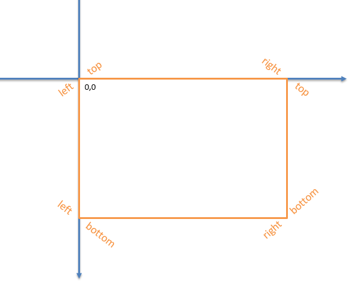
> >
> > 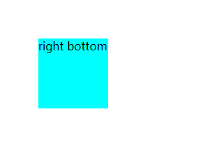
>
> + 百分比
>
> > 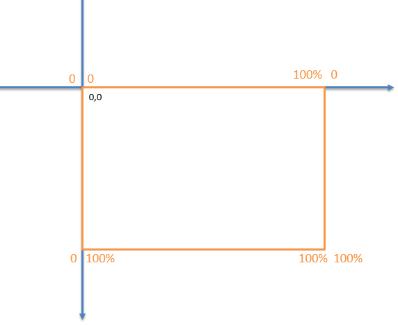
> >
> > 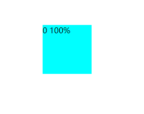
>
> + 整数，可以正数也可以是负数。
>
> > 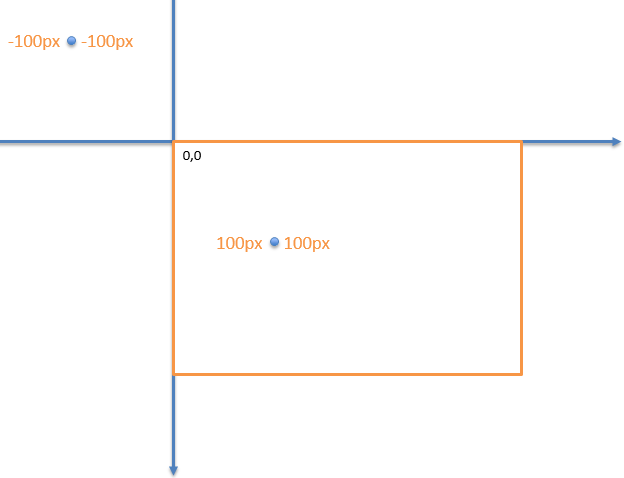
> >
> > 

示例：

> ```html
> <!DOCTYPE html>
> <html lang="en">
> <head>
>     <meta charset="UTF-8">
>     <meta name="viewport" content="width=device-width, initial-scale=1.0">
>     <title>Document</title>
>     <style>
>         body{
>             margin:100px;
>         }
>         
>         .box1{
>             width: 100px;
>             height: 100px;
>             background:cyan;
>             /* 修改变换基准点 */
>             /* transform-origin: right bottom; */
>             /* transform-origin: 0 100%; */
>             transform-origin: -30px -30px;
>             transition:all 1s;
>         }
>         .box1:hover{
>             transform:rotate(40deg);
>         }
>         
>     </style>
> </head>
> <body>
>     <div class="box1">-30px -30px</div>
> </body>
> </html>
> ```
>
> 


### 5.2、修改旋转变换的基准点

案例：旋转的老K

> ```html
> <!DOCTYPE html>
> <html lang="en">
> <head>
>     <meta charset="UTF-8">
>     <meta name="viewport" content="width=device-width, initial-scale=1.0">
>     <title>Document</title>
>     <style>
>         .wrap{
>             width: 155px;
>             height: 219px;
>             margin: 300px auto;
>             position: relative;
>         }
> 
>         .wrap img{
>             width:100%;
>             position: absolute;
>             border:1px solid #e9e9e9;
>             transform-origin: 0px 0px;
>             transition:all 2s;
>         }
> 
>         .wrap:hover img:nth-child(1){
>             transform:rotate(60deg);
>         }
> 
>         .wrap:hover img:nth-child(2){
>             transform:rotate(120deg);
>         }
> 
>         .wrap:hover img:nth-child(3){
>             transform:rotate(180deg);
>         }
> 
>         .wrap:hover img:nth-child(4){
>             transform:rotate(240deg);
>         }
> 
>         .wrap:hover img:nth-child(5){
>             transform:rotate(300deg);
>         }
> 
>         .wrap:hover img:nth-child(6){
>             transform:rotate(360deg);
>         }
>         
>     </style>
> </head>
> <body>
>     <div class="wrap">
>         
>         
>         
>         
>         
>         
>     </div>
> </body>
> </html>
> ```
>
> 

案例：旋转的秒钟

> ```html
> <!DOCTYPE html>
> <html lang="en">
> <head>
>  <meta charset="UTF-8">
>  <meta name="viewport" content="width=device-width, initial-scale=1.0">
>  <title>Document</title>
>  <style>
>      .panel{
>          width: 200px;
>          height: 200px;
>          margin: 100px auto;
>          border: 2px solid #000;
>          border-radius: 50%;
>          position: relative;
>      }
>    .hour{
>          width: 6px;
>          height: 25px;
>          background: #333;
>          position: absolute;
>          top: 25px;
>          left:99px;
>          box-shadow: 0 2px 5px rgba(0,0,0,.6);
>          /* 修改旋转基准点 */
>          transform-origin: 50% bottom;
>          transition:all 60s linear;
>      }
>    .min{
>          width: 2px;
>          height: 75px;
>          background: orange;
>          position: absolute;
>          top: 25px;
>          left:99px;
>          box-shadow: 0 2px 5px rgba(0,0,0,.6);
>          /* 修改旋转基准点 */
>          transform-origin: 50% bottom;
>          transition:all 60s linear;
>      }
> 
>      .sec{
>          width: 2px;
>          height: 75px;
>          background: red;
>          position: absolute;
>          top: 25px;
>          left:99px;
>          box-shadow: 0 2px 5px rgba(0,0,0,.6);
>          /* 修改旋转基准点 */
>          transform-origin: 50% bottom;
>          transition:all 60s linear;
>      }
> 
>      .panel:hover .sec{
>          transform: rotate(360deg);
>      }
>  </style>
> </head>
> <body>
>  <div class="panel">
>      <div class="hour"></div>
>      <div class="min"></div>
>      <div class="sec"></div>
>  </div>
> </body>
> </html>
> ```
>
> 


### 5.3、修改缩放变换基准点

案例:进度条

> ```html
> <!DOCTYPE html>
> <html lang="en">
> <head>
>     <meta charset="UTF-8">
>     <meta name="viewport" content="width=device-width, initial-scale=1.0">
>     <title>Document</title>
>     <style>
>        .wrap{
>            height: 20px;
>            width: 600px;
>            border:1px solid #ccc;
>            margin: 100px auto;
>            border-radius: 10px;
>            overflow: hidden;
>        }
> 
>        .progress{
>            height: 20px;
>            width: 1px;
>            border-radius: 10px;
>            background:cyan;
>             /* 设置缩放基准点 */
>            transform-origin: left top;
>            transition: all 5s linear;
>        }
> 
>        .wrap:hover .progress{
>            transform:scale(600,1);
>        }
> 
>     </style>
> </head>
> <body>
>     <div class="wrap">
>         <div class="progress">
>         </div>
>     </div>
> </body>
> </html>
> ```
>
> 


## 6. skew 2d倾斜(了解)

css语法：

> transform: skew(`xdeg`,`ydeg`)

说明：

> `xdeg`设置水平方向的倾斜角度
>
> `ydeg`设置垂直方向的倾斜角度
>
> `如果设置一个值，仅表示水平倾斜`

示例：

> ```html
> <!DOCTYPE html>
> <html lang="en">
> 
> <head>
>     <meta charset="UTF-8">
>     <meta name="viewport" content="width=device-width, initial-scale=1.0">
>     <title>Document</title>
>     <style>
>         .wrap {
>             height: 200px;
>             width: 800px;
>             margin: 100px auto;
>             display: flex;
>             justify-content: space-between;
>         }
> 
>         .wrap div {
>             width: 200px;
>             height: 200px;
>             background:#ccc;
>             transition: all 2s;
>         }
> 
>         .box1:hover{
>             transform:skew(30deg,0);
>         }
> 
>         .box2:hover{
>             transform:skew(0,30deg);
>         }
> 
>         .box3:hover{
>             transform:skew(30deg,30deg);
>         }
> 
>     </style>
> </head>
> 
> <body>
>     <div class="wrap">
>         <div class="box1"></div>
>         <div class="box2"></div>
>         <div class="box3"></div>
>     </div>
> </body>
> 
> </html>
> ```


# 三、transform属性3d转换

## 1、3d变换介绍

2d是平面，3d是空间

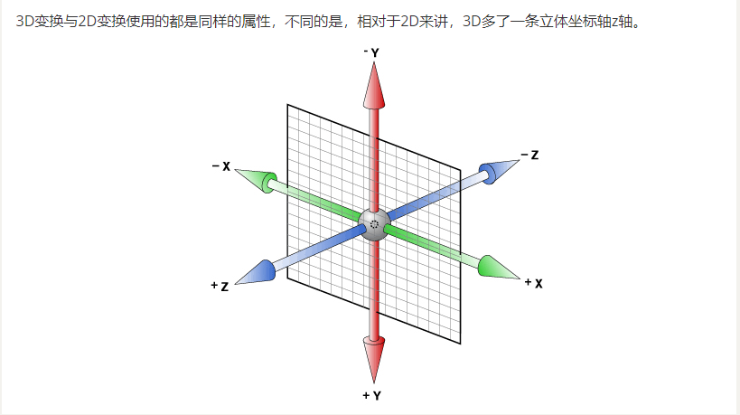

默认情况下，电脑屏幕是二维的并不是三维的。如果想实现三维效果，必须设置视距属性(perspective)，让css开启3d效果的模拟。

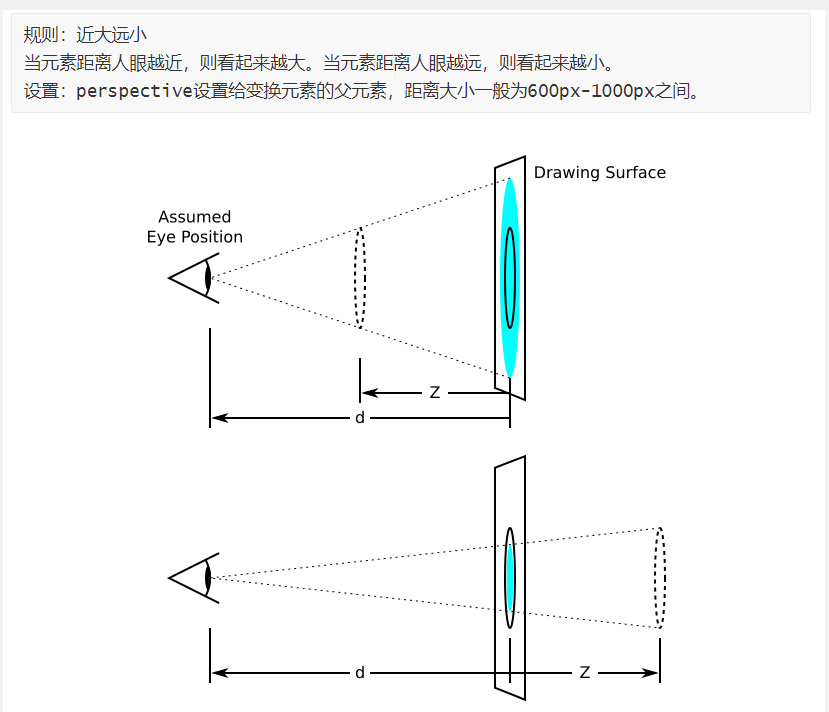

:point_right: 只要变换效果会呈现在垂直于电脑屏幕的方向就需要设置视距。

:point_right: 视距就是眼睛与物体之间的距离。用于模拟3d中近大远小的规则。

## 2、translate==x==\translate==y==\translate==z== 3d平移


```html
<!DOCTYPE html>
<html lang="en">

<head>
    <meta charset="UTF-8">
    <meta name="viewport" content="width=device-width, initial-scale=1.0">
    <title>Document</title>
    <style>
        body{
            /*  */
            perspective: 900px;
        }
        .wrap {
            height: 200px;
            width: 800px;
            margin: 100px auto;
            display: flex;
            justify-content: space-between;
            background:red;
        }

        .wrap div {
            width: 200px;
            height: 200px;
            background:#ccc;
            transition: all 2s;
        }

        .box1:hover{
            transform:translatex(30px);
        }

        .box2:hover{
            transform:translatey(30px);
        }

        .box3:hover{
            /* 由于是z轴移动，呈现的是3d效果，所以需要设置视距 */
            transform:translatez(30px);
        }

    </style>
</head>

<body>
    <div class="wrap">
        <div class="box1"></div>
        <div class="box2"></div>
        <div class="box3"></div>
    </div>
</body>

</html>
```

:point_right: 由于3d是包含2d的，所以translatex(x)与translatey(y)与transalte(x,y)实现的效果是一样的。


## 3、rotate==x==\rotate==y==\rotate==z== 3d旋转


```html
<!DOCTYPE html>
<html lang="en">

<head>
    <meta charset="UTF-8">
    <meta name="viewport" content="width=device-width, initial-scale=1.0">
    <title>Document</title>
    <style>
        body{
            margin:0 auto;
            perspective: 900px;
        }
        .wrap {
            height: 200px;
            width: 800px;
            margin: 100px auto;
            display: flex;
            justify-content: space-between;
            background:red;
        }

        .wrap div {
            width: 200px;
            height: 200px;
            background:#ccc;
            transition: all 2s;
        }

        .box1:hover{
            transform:rotatex(30deg);
        }

        .box2:hover{
            transform:rotatey(30deg);
        }

        .box3:hover{
            transform:rotatez(30deg);
        }

    </style>
</head>

<body>
    <div class="wrap">
        <div class="box1"></div>
        <div class="box2"></div>
        <div class="box3"></div>
    </div>
</body>

</html>
```

## 4、scale==x==\scale==y==\scale==z== 3d缩放


```html
<!DOCTYPE html>
<html lang="en">

<head>
    <meta charset="UTF-8">
    <meta name="viewport" content="width=device-width, initial-scale=1.0">
    <title>Document</title>
    <style>
        body{
            /*  */
            perspective: 900px;
        }
        .wrap {
            height: 200px;
            width: 800px;
            margin: 100px auto;
            display: flex;
            justify-content: space-between;
            background:red;
        }

        .wrap div {
            width: 200px;
            height: 200px;
            background:#ccc;
            transition: all 2s;
        }

        .box1:hover{
            transform:scalex(.5);
        }

        .box2:hover{
            transform:scaley(.5);
        }

        .box3:hover{
            transform:scalez(.5);
        }

    </style>
</head>

<body>
    <div class="wrap">
        <div class="box1"></div>
        <div class="box2"></div>
        <div class="box3"></div>
    </div>
</body>

</html>
```


# 四、@keyframes帧动画

## 1. @keyframes简介

+ transition动画存在的问题

> 动画不能自动开始(现阶段需要hover配合)
>
> 动画次数固定1次，不能循环播放。

+ @keyframes动画(帧动画)

> 可以自动开始
>
> 次数不限

+ 语法介绍

> 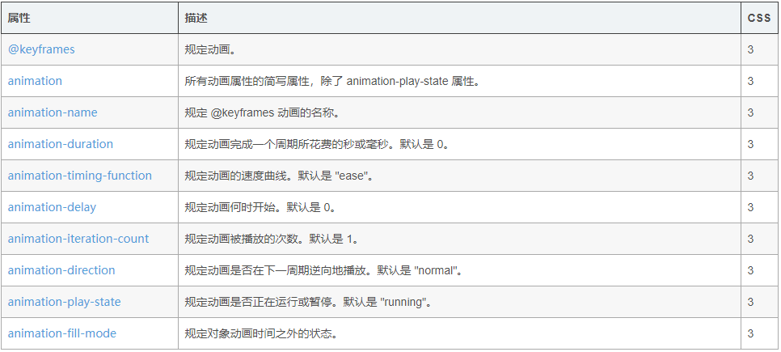

## 2. @keyframes动画的使用流程

### 2.1、 @keyframes定义动画

css语法：

> @keyframes `动画名`{
>
> ​	from{
>
> ​		// 开始css样式
>
> ​	}to{
>
> ​		// 结束css样式
>
> ​	}
>
> }
>
> :point_right: `当我们使用@keyframes定义好了一个动画，它并不会执行产生任何效果，直到我们通过animation属性将动画应用到相应元素上。`

### 2.2、animation应用动画

css语法：

> 

示例：

> 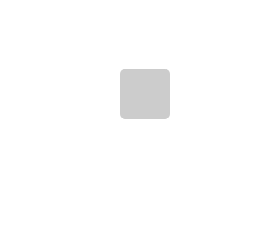
>
> ```html
> <!DOCTYPE html>
> <html lang="en">
> 
> <head>
>     <meta charset="UTF-8">
>     <meta name="viewport" content="width=device-width, initial-scale=1.0">
>     <title>Document</title>
>     <style>
>         
>         .box{
>             width: 50px;
>             height: 50px;
>             background:#ccc;
>             border-radius: 5px;
>             margin: 100px auto;
>             /* 应用动画 */
>             animation-name:xuhuan;
>             animation-duration:1s;
>         }
> 
>         /* 定义动画 */
>         @keyframes xuhuan{
>             from{
>                 border-radius: 0px;
>             }to{
>                 transform:rotate(360deg);
>                 border-radius: 50px;
>             }
>         }
>     </style>
> </head>
> 
> <body>
>     <div class="box"></div>
> </body>
> 
> </html>
> ```
>
> 

### 2.3、animation属性详解

+ animation-name

> 设置元素所要应用的帧动画

+ animation-duration

> 设置动画持续的时间

+ animation-delay

> 设置动画延时时间

+ animation-timing-function

> 设置动画的效果速度类型(与transition-timing-function相同)

- animation-fill-mode

> 常用的值为	forwards	动画停止时，元素的样式停留在最后一帧的样式

+ animation-iteration-count

> 设置动画播放的次数，取值：整数、infinite(无限播放)

+ animation-direction

> 指定动画是否反向播放或交替播放，需要设置多次播放才有效果
>
> 取值：normal, reverse, alternate, alternate-reverse
>
> > normal	开头  -> 结尾
> >
> > reverse	结尾  -> 开头
> >
> > alerternate	开头  -> 结尾  ->  开头  -> ...
> >
> > alternate	结尾  ->  开头  ->  结尾  ->  ...

+ animation-play-state

> paused	控制动画暂停

```html
<!DOCTYPE html>
<html lang="en">

<head>
    <meta charset="UTF-8">
    <meta name="viewport" content="width=device-width, initial-scale=1.0">
    <title>Document</title>
    <style>
        
        .box{
            width: 50px;
            height: 50px;
            background:#ccc;
            /* border-radius: 5px; */
            margin: 100px auto;

            /* 应用动画 */
            animation-name:xuhuan;
            animation-duration:2s;
            /* animation-delay: 2s; */
            /* animation-timing-function: linear; */
            /* animation-fill-mode:forwards; */
            animation-iteration-count: infinite;
            animation-direction:alternate-reverse;
        }

        .box:hover{
            animation-play-state: paused;
        }

        /* 定义动画 */
        @keyframes xuhuan{
            from{
                /* border-radius: 0px; */
                background:blue;
                transform:translateX(0);
            }to{
                transform:translateX(100px);
                /* transform:rotate(360deg); */
                /* border-radius: 50px; */
            }
        }
    </style>
</head>

<body>
    <div class="box"></div>
</body>

</html>
```


## 3. 百分比动画

​	from...to...	只能设置两个动画帧(两种状态)，如果想控制多种状态，可以使用百分比设置多个动画帧。

css语法：

> @keyframes `动画名`{
>
> ​	0%{
>
> ​		// 样式
>
> ​	}
>
> ​	n%{
>
> ​		// 样式
>
> ​	}
>
> ​	100%{
>
> ​		// 样式
>
> ​	}
>
> }

示例：

> ```html
> <!DOCTYPE html>
> <html lang="en">
> 
> <head>
>     <meta charset="UTF-8">
>     <meta name="viewport" content="width=device-width, initial-scale=1.0">
>     <title>Document</title>
>     <style>
>         *{
>             margin:0;
>             padding:0;
>         }
> 
>         .box{
>             width: 50px;
>             height: 50px;
>             background: #ccc;
>             animation: multi 3s linear alternate infinite;
>         }
> 
>         @keyframes multi {
>             0%{
>             }
>             20%{
>                 transform:translate(100px,0px);
>             }
>             40%{
>                 transform:translate(100px,100px)   
>             }
>             60%{
>                 transform:translate(200px,100px)   
>             }
>             80%{
>                 transform:translate(200px,200px)    
>             }
>             100%{
>                 transform:translate(0px,200px)   
>             }
>         }
>     </style>
> </head>
> <body>
>     <div class="box"></div>
> </body>
> </html>
> ```
>
> 

## 4. 案例：

### 4.1、页面加载动画：

> ```html
> <!DOCTYPE html>
> <html lang="en">
> 
> <head>
>     <meta charset="UTF-8">
>     <meta name="viewport" content="width=device-width, initial-scale=1.0">
>     <title>Document</title>
>     <style>
>         
>         body{
>             margin:0;
>             background:#ccc;
>         }
> 
>         img{
>             display: block;
>             margin: 200px auto 0;
>             width:100px;
>             height: 100px;
> 
>             animation: load 1s linear infinite;
>         }
>         p{
>             text-align: center;
>         }
> 
>         @keyframes load {
>             from{
>                 transform:rotate(0)
>             }to{
>                 transform:rotate(360deg)
>             }
>         }
> 
>     </style>
> </head>
> 
> <body>
>     
>     <p>loading ...... </p>
> </body>
> 
> </html>
> ```

### 4.2、大风车案例

> ```html
> <!DOCTYPE html>
> <html lang="en">
> 
> <head>
>     <meta charset="UTF-8">
>     <meta name="viewport" content="width=device-width, initial-scale=1.0">
>     <title>Document</title>
>     <style>
>         .box{
>             width: 300px;
>             margin: 200px auto;
>         }
> 
>         .box img{
>             animation: wind 2s infinite linear;
>         }
> 
>         @keyframes wind {
>             50%{
>                 transform:rotate(180deg);
>             }
>             100%{
>                 transform:rotate(360deg);
>             }
>         }
>     </style>
> </head>
> <body>
>     <div class="box">
>         
>     </div>
> </body>
> </html>
> ```
>
> 

### 4.3、热点图案例：

> ```html
> <!DOCTYPE html>
> <html lang="en">
> 
> <head>
>     <meta charset="UTF-8">
>     <meta name="viewport" content="width=device-width, initial-scale=1.0">
>     <title>Document</title>
>     <style>
>         
>         *{
>             margin:0;
>             padding:0;
>         }
> 
>         body{
>             /* background: #333; */
>         }
>         .box{
>             width: 747px;
>             height: 614px;
>             margin: 50px auto;
>             background: url(./rpc_map.png);
>             position: relative;
>         }
> 
>         .dot{
>             width: 8px;
>             height: 8px;
>             position: absolute;
>             left: 50%;
>             top: 50%;
>             transform:translate(-50%, -50%);
>             background: #09f;
>             border-radius: 50%;
>         }
> 
>         .wave{
>             width: 8px;
>             height: 8px;
>             position: absolute;
>             left: 50%;
>             top: 50%;
>             transform: translate(-50%, -50%);
>             border-radius: 50%;
>             box-shadow: 0 0 12px #009fd9;
>             animation: bo 1.2s linear infinite;
>         }
> 
>         .se{
>             animation-delay: .6s;
>         }
> 
>         @keyframes bo {
>             0%{
>             }
>             70%{
>                 width: 50px;
>                 height: 50px;
>                 opacity: 1;
>             }
>             100%{
>                 width: 70px;
>                 height: 70px;
>                 opacity: 0;
>             }
>         }
>     </style>
> </head>
> 
> <body>
>     <div class="box">
>         <div class="dot"></div>
>         <div class="wave"></div>
>         <div class="wave se"></div>
>     </div>
> </body>
> 
> </html>
> ```
>
> 

### 4.4、魔力转圈圈

> ```html
> <!DOCTYPE html>
> <html lang="en">
> 
> <head>
>     <meta charset="UTF-8">
>     <meta name="viewport" content="width=device-width, initial-scale=1.0">
>     <title>Document</title>
>     <style>
>         *{
>             margin:0;
>             padding:0;
>         }
> 
>         .box{
>             width: 50px;
>             height: 50px;
>             margin: 200px auto;
>             position: relative;
>         }
>         .item{
>             width: 50px;
>             height: 50px;
>             background: #ccc;
>             position: absolute;
>             background:rgb(155, 154, 152);
>             border-radius: 50%;
> 
>             transform: rotate(0) translate(-40px,0);
>         }
>         .one{
>             animation: rou 3s linear infinite;
>         }
>         .two{
>             animation: rou 3s linear 1s infinite;
>         }
>         .three{
>             animation: rou 3s linear 2s infinite;
>         }
> 
>         @keyframes rou {
>             100% {transform: rotate(360deg) translate(-40px);}
>         }
> 
>     </style>
> </head>
> <body>
>     <div class="box">
>         <div class="item one"></div>
>         <div class="item two"></div>
>         <div class="item three"></div>
>     </div>
> </body>
> </html>
> ```
>
> 

## 5、多态动画(课外了解)

```html
<!DOCTYPE html>
<html lang="en">

<head>
    <meta charset="UTF-8">
    <meta name="viewport" content="width=device-width, initial-scale=1.0">
    <title>Document</title>
    <style>
        
        .box{
            width:10px;
            height: 10px;
            background:orange;
            /* 逗号分隔可以应用多个动画，后面的动画要注意延时时间 */
            animation:w 2s ease-in forwards,h .2s ease-in-out 2s forwards 7 alternate;
        }


        /* 定义动画 */
        @keyframes w{
            from{
                width:0px;
            }to{
                width:200px;
            }
        }

        @keyframes h{
            from{
                height:0px;
            }to{
                height:200px;
            }
        }
    </style>
</head>

<body>
    <div class="box"></div>
</body>

</html>
```


## 6、百分比动画(课外了解)

```html
<!DOCTYPE html>
<html lang="en">

<head>
    <meta charset="UTF-8">
    <meta name="viewport" content="width=device-width, initial-scale=1.0">
    <title>Document</title>
    <style>
        
        .box{
            width:10px;
            height: 10px;
            background:orange;
            animation:w 3s linear forwards;
        }


        /* 定义动画 */
        @keyframes w{
            0%{
                /* transform:scale(1,1),translate(0,0); */
            }
            20%{
                transform: translate(100px, 200px) scale(3);
            }
            40%{
                
                transform: translate(200px, 200px) scale(5) rotate(360deg);
                border-radius: 50%;
            }
            60%{
                transform: translate(100px, 100px) scale(5) rotate(-360deg);
                border-radius: 0px;
            }
            100%{
                /* 没有设置的属性会自动向初始值回归 */
                transform: translate(100px, 100px) scale(5) rotate(0deg);
                border-radius: 50%;
            }
        }

    </style>
</head>

<body>
    <div class="box"></div>
</body>

</html>
```


